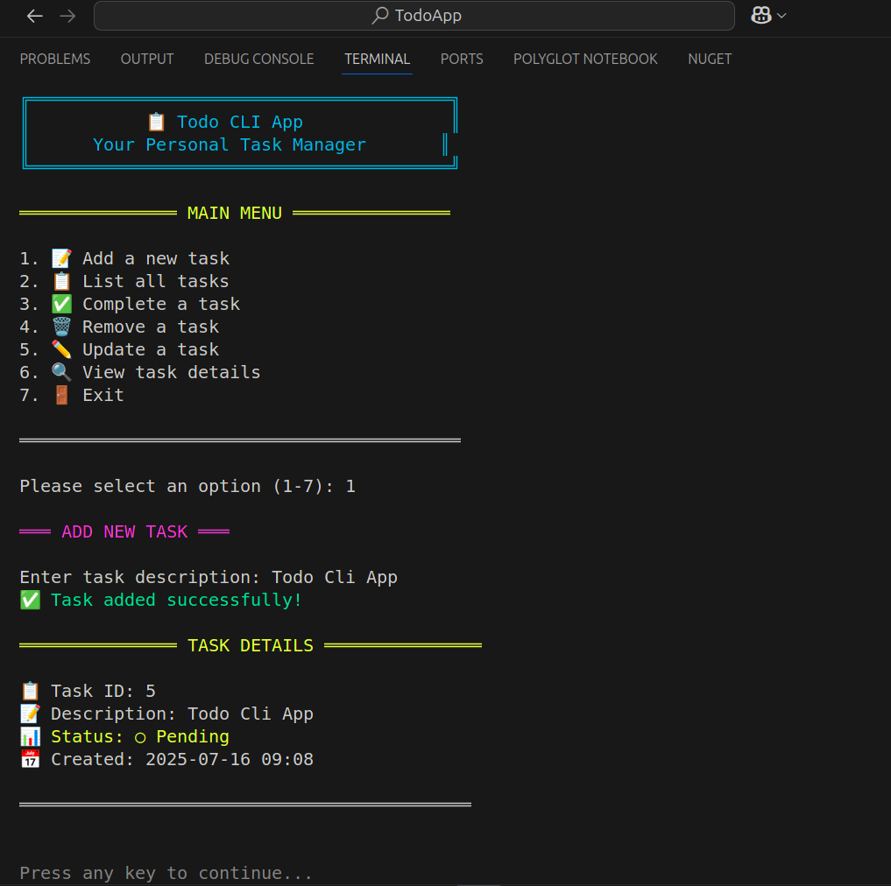
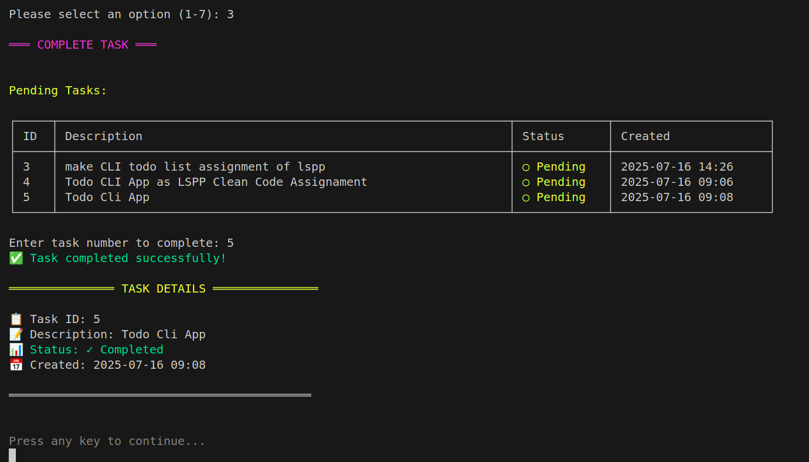
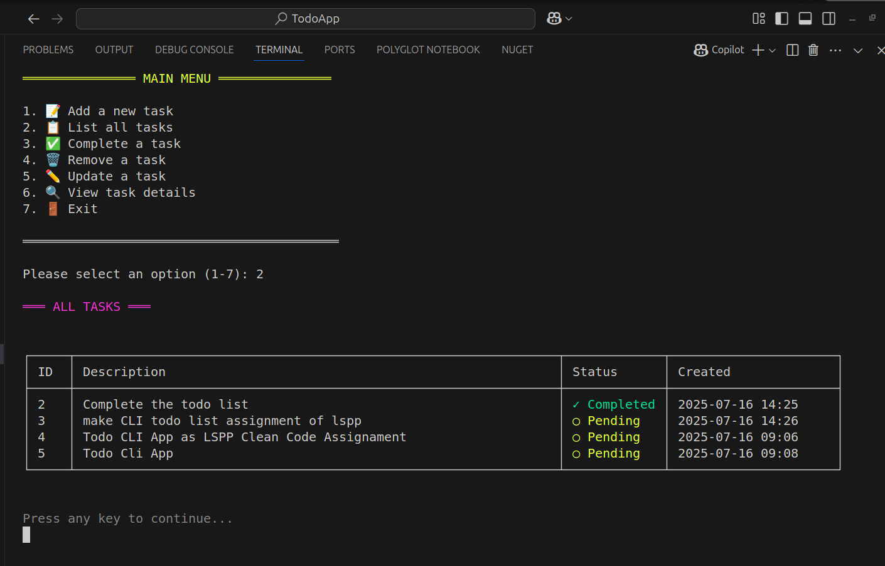
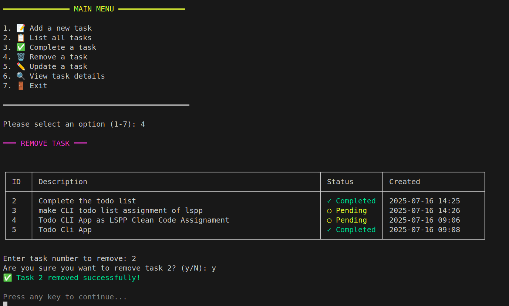
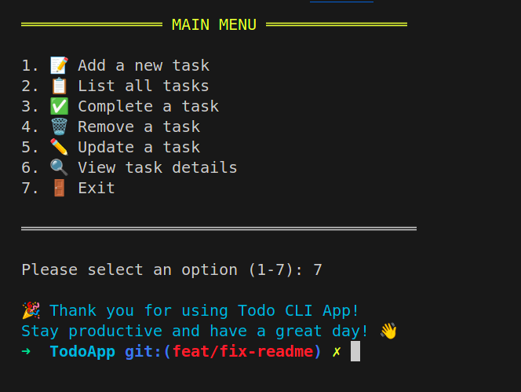

# Todo CLI Application

A simple, interactive command-line todo application built with C# following Clean Code principles and Clean Architecture patterns.

## 🚀 Features

- **Interactive Menu**: User-friendly menu-driven interface
- **Command-Line Interface**: Direct command execution for automation
- **Task Management**: Add, list, complete, remove, and update tasks
- **Persistent Storage**: Tasks are saved to JSON file
- **Error Handling**: Robust error handling with helpful messages
- **Clean Architecture**: Well-organized code structure following SOLID principles

## 📁 Project Structure

```
TodoApp/
├── Core/                           # Business logic and domain entities
│   ├── Entities/
│   │   └── TodoTask.cs            # Domain entity
│   ├── Interfaces/
│   │   ├── ITodoRepository.cs     # Repository contract
│   │   └── ITodoService.cs        # Service contract
│   └── Services/
│       └── TodoService.cs         # Business logic implementation
├── Infrastructure/                 # External concerns (data access)
│   └── Repositories/
│       ├── JsonTodoRepository.cs  # JSON file persistence
│       ├── TodoRepositoryAdapter.cs # Adapter pattern implementation
│       └── TodoTaskAdapter.cs     # Entity mapping
├── Application/                    # Application layer
│   ├── DTOs/
│   │   └── TodoTaskDto.cs         # Data transfer objects
│   └── Common/
│       ├── Result.cs              # Result pattern implementation
│       └── TodoTaskMapper.cs      # Entity-DTO mapping
├── Presentation/                   # User interface layer
│   └── CLI/
│       ├── ConsoleHelper.cs       # Console UI utilities
│       ├── IConsoleHelper.cs      # UI abstraction
│       ├── InteractiveTodoCliHandler.cs # Interactive menu handler
│       └── CommandLineHandler.cs  # Command-line argument handler
├── Program.cs                      # Application entry point
└── [Legacy files for backward compatibility]
```

## 🖼️ Screenshots

Below are example screenshots of the Todo CLI Application. Make sure your images are placed in the `View/IPhotoCollection` folder relative to your repository root.

```
View/
└── IPhotoCollection/
    ├── add.png
    ├── complete.png
    ├── list.png
    ├── remove.png
    └── exit.png
```

**Screenshots:**

- **Add Task:**  
  

- **Complete Task:**  
  

- **List Tasks:**  
  

- **Remove Task:**  
  

- **Exit Application:**  
  

### Prerequisites

- .NET 8.0 or higher
- Any terminal or command prompt

### Building the Application

```bash
# Clone or download the project
cd TodoApp

# Build the application
dotnet build

# Run the application
dotnet run
```

## 📖 Usage

### Interactive Mode (Default)

Simply run the application without arguments to start the interactive menu:

```bash
dotnet run
```

**Expected Output:**

```
╔════════════════════════════════════════╗
║           📋 Todo CLI App              ║
║      Your Personal Task Manager       ║
╚════════════════════════════════════════╝

═══════════════ MAIN MENU ═══════════════

1. 📝 Add a new task
2. 📋 List all tasks
3. ✅ Complete a task
4. 🗑️  Remove a task
5. ✏️  Update a task
6. 🔍 View task details
7. 🚪 Exit

══════════════════════════════════════════

Please select an option (1-7):
```

### Command-Line Interface

#### Add a Task

```bash
dotnet run -- add "Buy groceries"
```

**Expected Output:**

```
✅ Task added successfully!

═══════════════ TASK DETAILS ═══════════════

📋 Task ID: 1
📝 Description: Buy groceries
📊 Status: ○ Pending
📅 Created: 2025-01-16 10:30

═══════════════════════════════════════════
```

#### List All Tasks

```bash
dotnet run -- list
```

**Expected Output:**

```
All Tasks:

┌─────┬────────────────────────────────────────────────────────────────┬─────────────┬──────────────────────┐
│ ID  │ Description                                                    │ Status      │ Created              │
├─────┼────────────────────────────────────────────────────────────────┼─────────────┼──────────────────────┤
│ 1   │ Buy groceries                                                  │ ○ Pending   │ 2025-01-16 10:30     │
│ 2   │ Finish project                                                 │ ✓ Completed │ 2025-01-16 10:31     │
└─────┴────────────────────────────────────────────────────────────────┴─────────────┴──────────────────────┘
```

#### Complete a Task

```bash
dotnet run -- complete 1
```

**Expected Output:**

```
✅ Task completed successfully!

═══════════════ TASK DETAILS ═══════════════

📋 Task ID: 1
📝 Description: Buy groceries
📊 Status: ✓ Completed
📅 Created: 2025-01-16 10:30
✅ Completed: 2025-01-16 10:35

═══════════════════════════════════════════
```

#### Update a Task

```bash
dotnet run -- update 1 "Buy groceries and cook dinner"
```

#### Remove a Task

```bash
dotnet run -- remove 1
```

**Expected Output:**

```
✅ Task 1 removed successfully!
```

#### View Task Details

```bash
dotnet run -- view 1
```

#### Show Help

```bash
dotnet run -- help
```

**Expected Output:**

```
Todo CLI Application - Your Personal Task Manager

Usage:
  (no arguments)                      - Start interactive menu
  add <task description>              - Add a new task
  list                                - Show all tasks
  complete <task number>              - Mark a task as complete
  remove <task number>                - Remove a task
  update <task number> <description>  - Update a task description
  view <task number>                  - View task details
  help                                - Show this help message
  interactive                         - Start interactive menu

Examples:
  add "Buy groceries"
  complete 1
  update 1 "Buy groceries and cook dinner"
  remove 1
```

## 🧹 Clean Code Principles Applied

### 1. **Meaningful Names**

- **Classes**: `TodoTask`, `TodoService`, `ConsoleHelper`
- **Methods**: `AddTaskAsync()`, `CompleteTaskAsync()`, `ShowTaskDetails()`
- **Variables**: `taskDescription`, `isRunning`, `taskId`

### 2. **Single Responsibility Principle (SRP)**

- `TodoTask`: Only handles task entity logic
- `TodoService`: Only handles business logic
- `ConsoleHelper`: Only handles UI presentation
- `JsonTodoRepository`: Only handles data persistence

### 3. **Open/Closed Principle**

- Interfaces (`ITodoService`, `ITodoRepository`) allow extension without modification
- Repository pattern allows switching storage mechanisms

### 4. **Dependency Inversion**

- High-level modules depend on abstractions (interfaces)
- Concrete implementations are injected via constructor

### 5. **Small Functions**

- Methods are focused and do one thing well
- Average method length: 10-20 lines
- Complex operations are broken into smaller methods

### 6. **Error Handling**

- Result pattern for operation outcomes
- Graceful error handling with user-friendly messages
- Null reference protection with `ArgumentNullException.ThrowIfNull()`

### 7. **Code Organization**

- Clean Architecture layers separation
- Logical grouping of related functionality
- Consistent naming conventions

### 8. **Don't Repeat Yourself (DRY)**

- Common UI operations abstracted in `ConsoleHelper`
- Reusable Result pattern
- Shared validation logic

### 9. **Comments and Documentation**

- Self-documenting code with meaningful names
- XML documentation for public APIs
- README with usage examples

### 10. **Consistent Formatting**

- Consistent indentation and spacing
- Logical code grouping
- Clear separation of concerns

## 🏗️ Architecture Patterns Used

### Clean Architecture

- **Core**: Business logic and domain entities
- **Application**: Use cases and DTOs
- **Infrastructure**: External concerns (file I/O)
- **Presentation**: User interface

### Design Patterns

- **Repository Pattern**: Data access abstraction
- **Adapter Pattern**: Legacy code integration
- **Result Pattern**: Error handling without exceptions
- **Dependency Injection**: Loose coupling

### SOLID Principles

- **S**: Single Responsibility - Each class has one reason to change
- **O**: Open/Closed - Open for extension, closed for modification
- **L**: Liskov Substitution - Derived classes are substitutable
- **I**: Interface Segregation - Clients depend only on needed interfaces
- **D**: Dependency Inversion - Depend on abstractions, not concretions

## 📊 Data Storage

Tasks are persisted in a JSON file (`tasks.json`) in the application directory:

```json
[
  {
    "id": 1,
    "description": "Buy groceries",
    "isCompleted": false,
    "createdAt": "2025-01-16T10:30:00Z"
  },
  {
    "id": 2,
    "description": "Finish project",
    "isCompleted": true,
    "createdAt": "2025-01-16T10:31:00Z"
  }
]
```

## 🔧 Extending the Application

### Adding New Commands

1. Add method to `ITodoService` interface
2. Implement in `TodoService`
3. Add command handler in `CommandLineHandler`
4. Add interactive handler in `InteractiveTodoCliHandler`

### Adding New Storage Types

1. Implement `ITodoRepository` interface
2. Update dependency injection in `Program.cs`

### Adding New UI Types

1. Implement `IConsoleHelper` interface
2. Create new presentation layer handlers

## 🐛 Error Handling Examples

### Invalid Task ID

```bash
dotnet run -- complete 999
```

**Output:**

```
❌ Error: Task with ID 999 not found
```

### Empty Task Description

```bash
dotnet run -- add ""
```

**Output:**

```
❌ Error: Task description cannot be empty
```

### Invalid Command

```bash
dotnet run -- invalid-command
```

**Output:**

```
❌ Error: Unknown command: invalid-command
```

## 🤝 Contributing

1. Follow the existing code style and patterns
2. Ensure all methods have proper error handling
3. Add appropriate tests for new functionality
4. Update documentation as needed

## 📝 License

This project is for educational purposes demonstrating Clean Code principles and Clean Architecture in C#.
